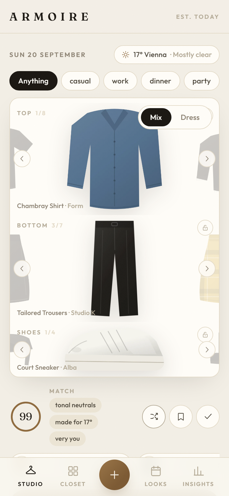

# ARMOIRE

**Your wardrobe, as software.** Photograph your clothes; they get cut out and tagged.
Then swipe tops, bottoms and shoes into one composed picture — scored live for colour
harmony, weather, dress code and what you've actually been wearing.

Yes, like *Clueless*.

Everything is **local-first**. Items, images, looks, wear history and plans live in your
browser's IndexedDB. No account, no server, no cloud, nothing leaves the machine unless
you opt into AI tagging.

<p align="center">
  
</p>

---

## Run it

```bash
npm install
npm run dev
```

<http://localhost:3985>

Requires Node 18+ and a Chromium or Firefox build with WebAssembly and IndexedDB — that
is every current desktop browser. First upload downloads a ~40 MB background-removal
model into browser cache; after that, cutouts work offline.

### Optional AI tagging

```bash
cp .env.example .env.local     # set ANTHROPIC_API_KEY
```

With a key, Claude vision pre-fills category / colours / style / season / occasion on
upload. **Without a key the app is fully functional** — colours are detected locally and
you confirm tags in the review step. The key is used by a Next route on your own
machine; photos are sent to Anthropic only when it is set.

---

## What it does

**Add** — multi-photo upload, on-device background removal, automatic colour detection,
AI or manual tagging, warmth and formality dials, purchase price for cost-per-wear.

**Studio** — the main screen. Swipe top / bottom / shoes independently, lock a slot you
like, add a layer and a bag. A live match score explains itself in words rather than
just a number. Shuffle, save, mark "worn today".

*Dress me today* proposes 3–5 complete looks from the weather (Open-Meteo, keyless),
today's calendar events, your favourite colours and what you wore recently.

**Closet** — grid with natural search: `black dress`, `work winter`, `unworn`. Filter by
kind and colour, track laundry state, keep a wishlist that previews what a prospective
purchase *pairs with* and *unlocks*. Capsule builder.

**Looks** — saved outfits, a 7-day planner with per-day forecast and events, auto-plan,
full wear history.

**Insights** — most and least worn, cost per wear, closet-vs-worn colour balance,
seasonal usage, versatility ranking, wardrobe gap suggestions, and a learned Style DNA.

**Pack** — destination, dates and agenda become a minimal case: day-by-day outfits and a
checklist, built from the smallest set of items that covers the trip.

---

## Stack

Next.js 16 · React 19 · Tailwind 4 · motion · Dexie (IndexedDB) ·
[@imgly/background-removal](https://github.com/imgly/background-removal-js) (on-device) ·
[Open-Meteo](https://open-meteo.com) (keyless weather + geocoding) · optional Anthropic
API route.

---

## Data and privacy

There is no backend to breach. Your closet is rows in IndexedDB on one device — which
also means **clearing site data deletes your wardrobe**, and there is currently no
export or sync. If you are going to put real money's worth of clothing in here, that
gap is worth knowing about up front.

---

## License

MIT. See [LICENSE](LICENSE).
